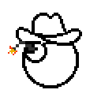
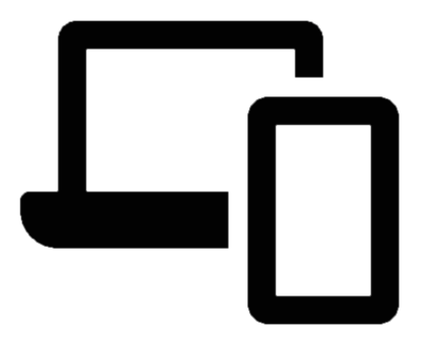
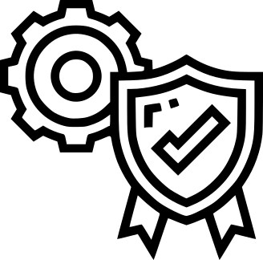

	<a href="#" target="_blank">
    	<h2>
      	Meu Portfólio
    	</h2>
  	</a>
	<!--Ferramentas-->
	
	<!--Jogos-->
	<h1>🎮 Jogos</h1>
	<table>
		<tr>
			<th align="center" width="90">Ícone</th>
			<th align="left">Projeto</th>
			<th align="center" width="110">Engine</th>
			<th align="center" width="110">Status</th>
		</tr>
		<tr>
			<td align="center">
				<a href="https://github.com/JpMunhozOliveira/Dark-Depths">
					<picture>
						<source media="(prefers-color-scheme: dark)" srcset="resources/images/Projects/DarkDepthsIconLight.png">
						
					</picture>
				</a>
			</td>
			<td align="left"><a href="https://github.com/JpMunhozOliveira/Dark-Depths">Dark Depths</a></td>
			<td align="center"></td>
			<td align="center">✅ Concluído</td>
		</tr>
		<tr>
			<td align="center">
				
			</td>
			<td align="left">Into the Depths (repositório privado)</td>
			<td align="center"></td>
			<td align="center">🚧 Em desenvolvimento</td>
		</tr>
	</table>
	<!--Projetos-->
	<h1>🛠️ Projetos</h1>
	<table>
		<tr>
			<th align="center" width="90">Ícone</th>
			<th align="left">Projeto</th>
			<th align="center" width="110">Stack</th>
			<th align="center" width="110">Status</th>
		</tr>
		<tr>
			<td align="center">
				
			</td>
			<td align="left"><a href="https://github.com/JpMunhozOliveira/Security-cam">Sistema de Detecção de Pessoas via Câmera</a></td>
			<td align="center"></td>
			<td align="center">✅ Concluído</td>
		</tr>
		<tr>
			<td align="center">
				
			</td>
			<td align="left">Estoque-IA (repositório privado)</td>
			<td align="center"></td>
			<td align="center">🚧 Em desenvolvimento</td>
		</tr>
	</table>
	<!---Cursos--->
	<h1>Cursos</h1>
 	<table>
  		<tr>
    		<th></th>
    		<th></th>
			<th></th>
  		</tr>
  		<tr>
   			<td align="center" width="250">
      			<a href="https://github.com/JpMunhozOliveira/Responsive-Web-Design/blob/main/README.md">
       				<picture>
         				<source media="(prefers-color-scheme: dark)" srcset="resources/icons/courses/freecodecamp/Web_Development_Icon_Light.png">
         				
       				</picture>
      			</a>
      			 Responsive Web Design
   			</td>
   			<td align="center" width="250">
     			<a href="https://github.com/JpMunhozOliveira/QA-EBAC/blob/main/README.md">
       				<picture>
         				<source media="(prefers-color-scheme: dark)" srcset="resources/icons/courses/EBAC/QAE_Icon_Light.png">
         				
       				</picture>
      			</a>
      			 Engenharia de Qualidade de Software
  			</td>
			<td align="center" width="250">
     			<a href="https://github.com/JpMunhozOliveira/Imersao-Dev-10">
       				<picture>
         				
       				</picture>
      			</a>
      			 10º Imersão Dev
  			</td>
  		</tr>
	</table>
	<!--Estudos e Clones-->
	<h1>📚 Estudos e Clones</h1>
	

		
Ver projetos de aprendizado (clones de jogos clássicos)

		 
		<table>
			<tr>
				<th align="left">Projeto</th>
				<th align="center" width="110">Engine</th>
			</tr>
			<tr>
				<td align="left"><a href="https://github.com/JpMunhozOliveira/Breakout-Unity-Csharp">Breakout</a></td>
				<td align="center"></td>
			</tr>
			<tr>
				<td align="left"><a href="https://github.com/JpMunhozOliveira/Flappy-Bird">Flappy Bird</a></td>
				<td align="center"></td>
			</tr>
			<tr>
				<td align="left"><a href="https://github.com/JpMunhozOliveira/Minesweeper-Unity-Csharp">Minesweeper</a></td>
				<td align="center"></td>
			</tr>
			<tr>
			<td align="left"><a href="https://github.com/JpMunhozOliveira/Pong-Html5-Js">Pong</a></td>
			<td align="center"></td>
		</tr>
		<tr>
			<td align="left"><a href="https://github.com/JpMunhozOliveira/Snake-Html5-Js">Snake</a></td>
			<td align="center"></td>
		</tr>
		</table>
	

