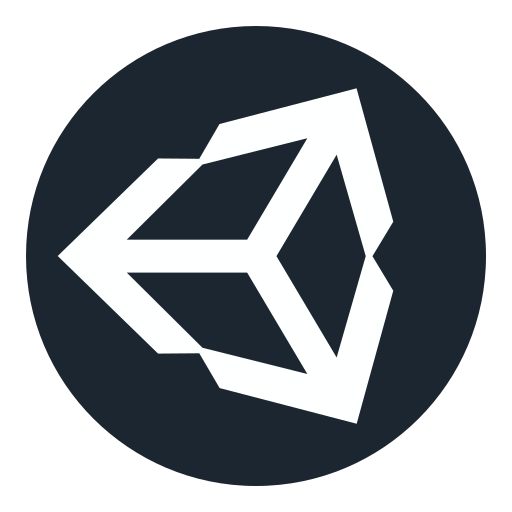

### 👋Hi there, I'm João Pedro

- Unity game developer 🎮
- Front-end developer (in progress)🌐

 I absolutely love taking on creative and challenging projects that help me learn new things and hone my programming skills. 💪🏼💻🚀

On my GitHub profile, you'll find some of the projects I've developed and the contributions I've made to open-source projects. Feel free to explore and add your own comments and suggestions! 🙌🏼

### 📩Links

📧 If you'd like to get in touch, you can send me a message:

 
 
 
 

### 💻My Environment

Tools, languages, and other things that I like to work with.

 

 <h4> Apps </h4>
 
 
 <h4> Languages </h4>
 
 
 
 
 

 
 

>Note: I'm easily adapting to new programming languages and environments, so they're not posing a major challenge for me 📖💡

### ⚡Projects

Some of my projects.

 <table>
  
 <!------------------------Header Unity------------------------->
  
  <tr>
   <th colspan="5"> Unity </th>
  </tr>

  <tr>
   <th colspan="1">My games</th>

   <th colspan="3">Other Projects</th>
  </tr>
  
 <!-----------------------Projects Unity------------------------>
  
  <tr>
    <td align="center" width="126" height="150">
      <a href="https://github.com/JpMunhozOliveira/Dark-Depths">
       <picture>
         <source media="(prefers-color-scheme: dark)" srcset="resources/images/Projects/DarkDepthsIconLight.png">
         
       </picture>
      </a>
       Dark Depths
   </td>

   
   <td align="center" width="126">
      <a href="https://github.com/JpMunhozOliveira/Breakout-Unity-Csharp">
       <picture>
         <source media="(prefers-color-scheme: dark)" srcset="resources/images/Projects/BreakoutIconLight.png">
         
       </picture>
      </a>
       Breakout
   </td>
  
   <td align="center" width="126">
      <a href="https://github.com/JpMunhozOliveira/Flappy-Bird">
       <picture>
         <source media="(prefers-color-scheme: dark)" srcset="resources/images/Projects/FlappyIconLight.png">
         
       </picture>
      </a>
       Flappy Bird
   </td>
   
   <td align="center" width="126">
      <a href="https://github.com/JpMunhozOliveira/Minesweeper-Unity-Csharp">
       <picture>
         <source media="(prefers-color-scheme: dark)" srcset="resources/images/Projects/MinesweeperIconLight.png">
         
       </picture>
      </a>
       Minesweeper
   </td>
  </tr>
 </table>

<!-----------------------Header HTML------------------------>
<table>
 <tr>
   <th colspan="3"> HTML </th>
 </tr>
 <tr>
  
  <td align="center" width="126">
      <a href="https://github.com/JpMunhozOliveira/Pong-Html5-Js">
       <picture>
         <source media="(prefers-color-scheme: dark)" srcset="resources/images/Projects/PongIconLight.png">
         
       </picture>
      </a>
       Pong
   </td>
  
   <td align="center" width="126">
      <a href="https://github.com/JpMunhozOliveira/Snake-Html5-Js">
       <picture>
         <source media="(prefers-color-scheme: dark)" srcset="resources/images/Projects/SnakeIconLight.png">
         
       </picture>
      </a>
       Snake
   </td>
  
 </tr>
</table>
 

 

### 🏫Courses

Courses that I have already taken or am currently taking.

 <table>
  
 <!------------------------Header------------------------->
  
  <tr>
   <th colspan="1"> freeCodeCamp </th>
  </tr>
  
 <!-----------------------Projects------------------------>
  
  <tr>
   <td align="center" width="250">
      <a href="https://github.com/JpMunhozOliveira/Responsive-Web-Design/blob/main/README.md">
       <picture>
         <source media="(prefers-color-scheme: dark)" srcset="resources/icons/courses/freecodecamp/Web_Development_Icon_Light.png">
         
       </picture>
      </a>
       Responsive Web Design
   </td>
  </tr>
  
 </table>

